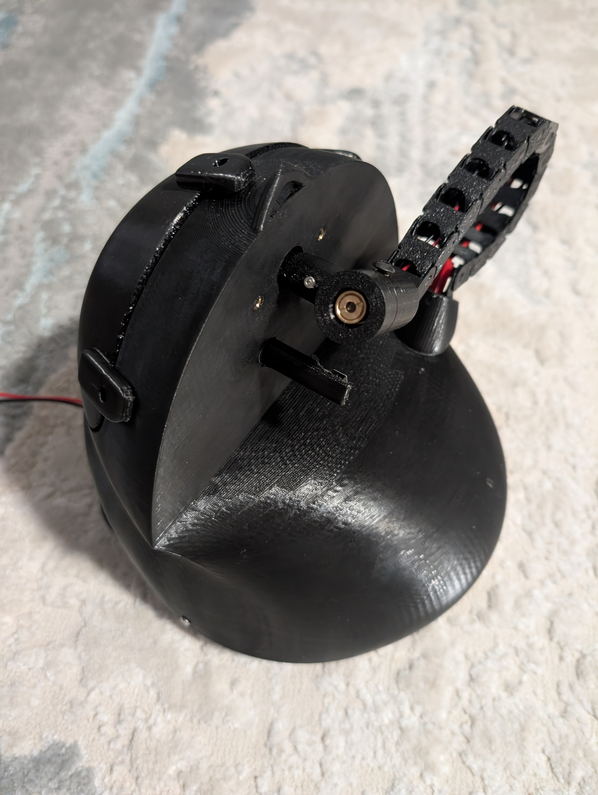
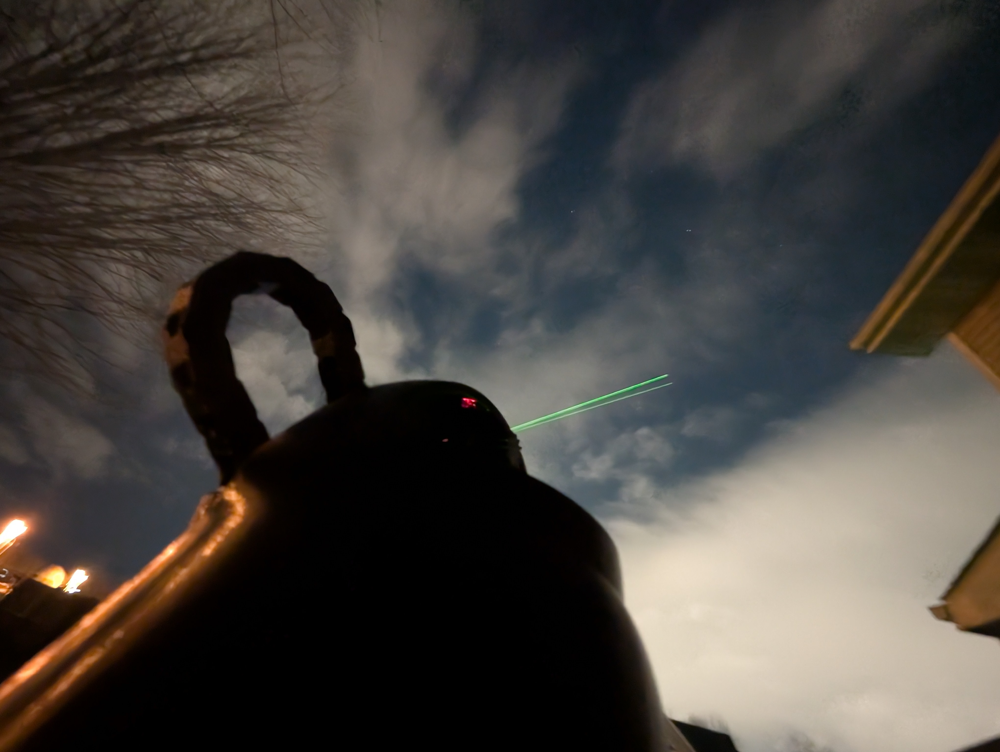

# Celestial Pointer

A Raspberry Pi-based device that points a laser at stars, planets, satellites.



## Features

- **Dual Motor Control**: Base rotation and laser elevation control
- **REST API**: Full API for controlling the device
- **Body Support**: Stars, planets, satellites (ISS)



## Hardware

- Raspberry Pi Zero 2 W
- 2x 28BYJ-48 stepper motors with ULN2003 drivers
  - Motor Specifications: 512 steps per full rotation (external shaft)
  - Motor 2 has additional gear reduction (20:14 ratio) for laser elevation
- Relay module for laser control
- Calibration button
- .3mf files for 3d printing included - SPBeta.3mf


# Attribution
3d printed lazy susan base design: https://makerworld.com/en/models/519260-v2-fully-printed-lazy-susan-conical-bearing-180mm?from=search#profileId-435623

Drag Chain: https://makerworld.com/en/models/591471-drag-cable-chain-s?from=search#profileId-513213


## Installation

1. Install dependencies:
```bash
pip3 install -r requirements.txt
```

2. Configure your location in the main script or via command line arguments.

## Usage

### Startup

```bash
python3 -m celestial_pointer.main --latitude 37.7749 --longitude -122.4194
```
After starting the python script it will boot and turn the laser on and angle it upwards. It will 
ask for you to point the laser north. This is how it will know it's heading. After pointing the laser
north press enter and it will start the api.


The API will be available at `http://localhost:8000`

### API Endpoints

- `GET /` - API information
- `GET /status` - Current system status
- `POST /target/orientation` - Point at specific azimuth/elevation
- `POST /target/star` - Point at a star by name
- `POST /target/planet` - Point at a planet by name
- `POST /target/satellite` - Point at Satellite By name or NORAD ID
- `POST /detarget` - Stop pointing and turn off laser
- `POST /laser/toggle` - Toggle laser on/off
- `GET /laser/status` - Get laser status

See API documentation at `http://localhost:8000/docs` when server is running.

## Examples

Example Auto pointing

```bash
curl -X POST http://localhost:8000/target/nearest-group -H 'Content-Type: application/json' -d '{}'
```


Pointing at a star
```
curl -X POST http://localhost:8000/target/star \
  -H "Content-Type: application/json" \
  -d '{"star_name": "Sirius"}'
```

```
curl -X POST http://localhost:8000/target/star \
  -H "Content-Type: application/json" \
  -d '{"star_name": "HIP32349"}'
  ```

Pointing at a planet/moon
```
curl -X POST http://localhost:8000/target/planet \
  -H "Content-Type: application/json" \
  -d '{"planet_name": "moon"}'
```

Pointing at a satellite
```
curl -X POST http://localhost:8000/target/satellite \
  -H "Content-Type: application/json" \
  -d '{"satellite_id": "ISS"}'
```

Pointing at satellite by NORAD ID
```
curl -X POST http://localhost:8000/target/satellite \
  -H "Content-Type: application/json" \
  -d '{"satellite_id": "25544"}'
```


## Configuration

Edit `celestial_pointer/config.py` to adjust:
- Pin assignments
- Motor settings
- Elevation limits
- Calibration parameters
- API settings

## Safety Features

- Laser elevation range limiting (default: -50° to 90°)
- Automatic laser flashing when body is out of range
- Laser turns off when no body is selected
- Slow initial movement speed for safety

## Project Structure

```
celestial_pointer/
  ├── __init__.py
  ├── config.py              # Configuration constants
  ├── motor_controller.py    # Motor control
  ├── laser_controller.py    # Laser control and range limiting
  ├── calibration.py         # Z-axis calibration
  ├── target_calculator.py   # Astronomy calculations
  ├── api.py                 # REST API server
  └── main.py                # Main application entry point

tests/
  ├── test_motor_controller.py
  ├── test_laser_controller.py
  └── test_target_calculator.py
```

## License

MIT

